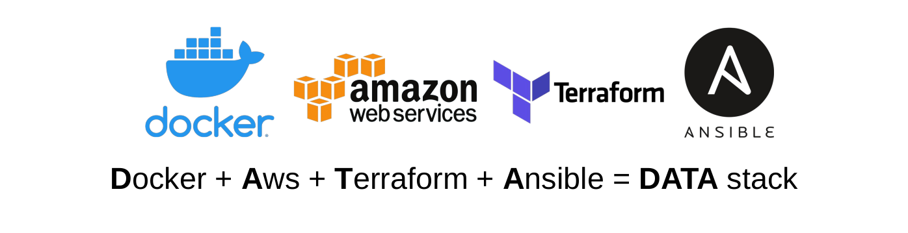

# Automation



| Docker Image | Version |
| ------------ | ------- |
| [phrh-client](https://hub.docker.com/repository/docker/blyndusk/phrh-client) |  |
| [phrh-server](https://hub.docker.com/repository/docker/blyndusk/phrh-server) |  |

## Terraform

1. **Generate** RSA *public/private* key pair:

  ```bash
  ssh-keygen -t rsa -b 4096
  ```

2. **Replace** the *public key* (`<YOUR_PUBLIC_KEY>`)

    - **File**: `automation/terraform/ec2.tf`

    ```terraform
    resource "aws_key_pair" "phrh_g12_ssh_key_pair" {
      key_name   = "phrh_g12_public_ssh_key"
      public_key = "<YOUR_PUBLIC_KEY>"
    }
    ```

3. (Optional) **Replace** the *region* here: 

    - **File**: `automation/terraform/provider.tf`

    ```terraform
    provider "aws" {
      profile = "default"
      region  = "<YOUR_REGION>"
    }
    ```

4. Create an **AWS EC2 instance**, running with `Ubuntu@18.04` with *security groups*, *public/private key pair*, *vpc*, run these commands:

> Current directory: `automation/terraform`

  - **Init** the terraform folder:

  ```bash
  terraform init
  ```

  - **Visualize** the modifications ( *added, changed, destroyed* ):

  ```bash
  terraform plan
  ```

  - **Apply** modifications: 

  ```bash
  terraform apply
  ```

## Ansible 

1. **Get** the `IPv4` adress on the `AWS EC2` console, and **replace** the *old adress*: 

    - **File**: `automation/ansible/inventory.ini` :
   
    ```ini
    [app]
    <IPV4_AWS_EC2_ADRESS>
    ```

2. To **install dependenciess** like Python, Docker, run this command:

> Current directory: `automation/ansible`

```bash
ansible-playbook -i inventory.ini app.yml --key <YOUR_PRIVATE_KEY> --user ubuntu --tags="install"
     
```

3. To **deploy the application to your EC2 instance**, run this command:

> Current directory: `automation/ansible`

```bash
ansible-playbook -i inventory.ini app.yml --key <YOUR_PRIVATE_KEY> --user ubuntu --tags="deploy"       
```

4. To **build new client & server docker images**, run this command:

> Current directory: `automation/ansible`

```bash
ansible-playbook -i inventory.ini app.yml --key <YOUR_PRIVATE_KEY> --user ubuntu --tags="build"       
```

4. To do all this **in one time**, run this command:

> Current directory: `automation/ansible`

```bash
ansible-playbook -i inventory.ini app.yml --key <YOUR_PRIVATE_KEY> --user ubuntu        
```

